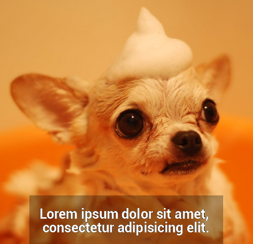

# Images

A small library to generate thumbnails and do a bit of editing.  
Why? Because the gd library is a pain to deal with.

Lets start with practical examples:


## Cropping

Inform the x and y coordinates as well the dimensions.
```php
$file = new File('images/photo.jpg');

$file->crop(255, 155, 1125, 1086);

header('Content-type: '.$file->mime);
$file->imageJpg();
```


## Resizing

```php
$file->resize(500); // height is optional, if not informed the ratio will be maintained
```


## Text

The Text class allow us to create labels, with padding, a background, 
to specify the line-height and text alignment.

```php
$text = 
'Lorem ipsum dolor sit amet, 
consectetur adipisicing elit.';

$text = new Text($text);

$text->fontFile('fonts/Roboto-Bold.ttf')
->padding(20)
->alignment('center')
->fontSize(20)
->lineHeight(20)
->color('#fff') // accepts hexadecimal values
->background('rgba(0,0,0,0.3)'); // as well as css' rgb function

$label = $text->getImage();

header('Content-type: image/png');
$label->imagePng();
```


## Pasting

```php
$file->paste($label, ($file->width - $label->width) / 2, $file->height - $label->height);
```


