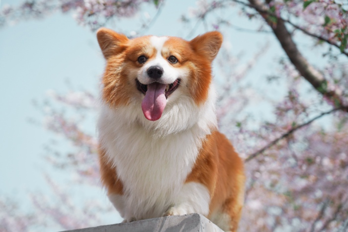
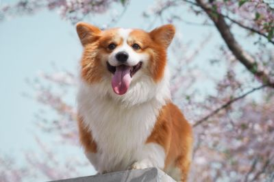
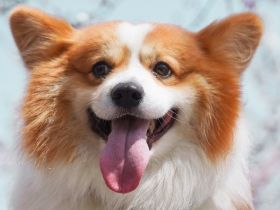
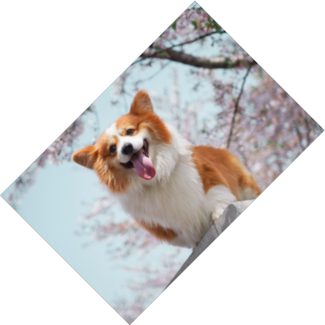
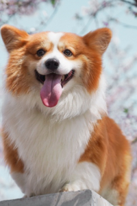
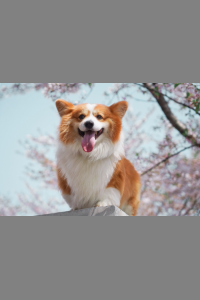

# Images

A small library to generate thumbnails and do a bit of editing.  
The gd library is procedural and difficult to use, so I created this library to make things a little easier.


## Features

- Object oriented.
- Smart methods with less obligatory parameters.
- Methods accept hexadecimal and rgb syntax strings for colors.


## Basic editing

Our reference: 


<small>Photo by [ipet photo](https://unsplash.com/@ipet_photo?utm_source=unsplash&utm_medium=referral&utm_content=creditCopyText) on [Unsplash](https://unsplash.com/?utm_source=unsplash&utm_medium=referral&utm_content=creditCopyText)</small>


### ::resize(int $width, int $height = null)

Resize the image. Only one parameter is needed, if only a single parameter is informed then the ratio will be preserved.

```php
use AdinanCenci\Images\File;

$picture = new File('example-original.jpg');
$picture->resize(400);

header('Content-type: image/png');
$file->imageJpg();
```




### ::crop(int $x, int $y, int $width, int $height)

Crop the image to the given rectangle.

```php
$picture = new File('example-original.jpg');
$picture->crop(185, 50, 280, 210);

header('Content-type: image/jpeg');
$picture->imageJpg(null, 80);
```




### ::copy(int $x = 0, int $y = 0, int $width = null, int $height = null)

Copy part of the image. All the parameters are optional, if left empty it will return a copy of the image.

```php
$copy = $picture->copy();
```


### ::paste(Image $image, int $x = 0, int $y = 0, int $width = null, int $height = null)

Paste a image on top. Besides $image, all parameters are optional. If left empty, it will paste at the top left corner, with $image's dimensions unaltered.

```php
$file = new File('./my-image.jpeg');
$picture = new Image(500, 500);

$picture->paste($file);
```


### ::rotate(int $angle, color identifier/string $color = 'rgba(0,0,0,0)')

Rotates the image according to $angle. Will apply $color to the background.

```php
$picture = new File('example-original.jpg');
$picture->resize(400);
$picture->rotate(45);

header('Content-type: image/png');
$picture->imagePng(null, 80);

```



## Thumbnails

The class comes with methods to easily create thumbnails.

### ::fillWith($image, $align = '')

Will fill the entire area with $image, cropping as needed.

```php
$picture = new File('example-original.jpg');
$thumbnail = new TrueColor(200, 300);

$thumbnail->fillWith($picture);

header('Content-type: image/png');
$thumbnail->imagePng();
```




### ::fit($image, $align = '')

Will fit $image inside the constrains without cropping. 

```php
$picture = new File('example-original.jpg');
$thumbnail = new TrueColor(200, 300);
$thumbnail->fill('rgba(0,0,0,127)'); // just to make the background visible

$thumbnail->fit($picture);

header('Content-type: image/png');
$thumbnail->imagePng();
```




## Multi-line text paragraph

```php
$text =
'Lorem ipsum dolor sit amet, consectetur adipisicing elit, sed do eiusmod
tempor incididunt ut labore et dolore magna aliqua. Ut enim ad minim veniam,
quis nostrud exercitation ullamco laboris nisi ut aliquip ex ea commodo
consequat. Duis aute irure dolor in reprehenderit in voluptate velit esse
cillum dolore eu fugiat nulla pariatur. Excepteur sint occaecat cupidatat non
proident, sunt in culpa qui officia deserunt mollit anim id est laborum.';

$t = new Text($text);
$t->fontFile('./fonts/Roboto-Bold.ttf')
->alignment('justify')
->color('rgba(255,255,255)')
->background('rgba(255,0,0,0.5)')
->padding(20)
->width(500);

$imagem = $t->getImage();

header('Content-type: image/png');
$imagem->imagePng();
```


## Dimensions shorthands

The class offer short hands to the image's dimensions:

```php
$picture = new TrueCollor(1000, 600);

$picture->halfWidth;     	// 500
$picture->oneThirdWidth;	// 333.3333...
$picture->halfHeight;   	// 300

// If you ommit the measure, it defaults to width:
$picture->half;  			// 500
$picture->oneThird;			// 333.3333...
$picture->oneTenth;  		// 100

// So you may use it:
$picture->resize($picture->half);
```


## Filters

**::invert()**

**::greyScale()**

**::brightness($level)**
$level: Integer between -255 to 255

**::contrast($level)**
$level: integer, 0 = no change, -100 = max contrast, 100  = min contrast

***::colorize($r, $g, $b, $a = null)**
Adds or subtract rgb values from each pixel
From -255 to 255

**::edge($times = 1)**
$times: Integer, how many times the filter must be applied.

**::boss($times = 1)**
$times: Integer, how many times the filter must be applied.

**::meanRemoval($times = 1)**
$times: Integer, how many times the filter must be applied.

**::gaussianBlur($times = 1)**
$times: Integer, how many times the filter must be applied.

**::blur($times = 1)**
$times: Integer, how many times the filter must be applied.

**::smooth($level)**
$times: Integer, how many times the filter must be applied.

**::pixelate($size, $advanced = false)**
$size: Integer, block size in pixels
$advanced: Boolean, whether to use advanced pixelation effect or not.

**::scatter($substraction, $addition, $color = null)**
$substraction: Integer, substraction level. This must not be higher or equal to the $addition level.
$addition: Integer, effect addition level.
$color: identifier/string